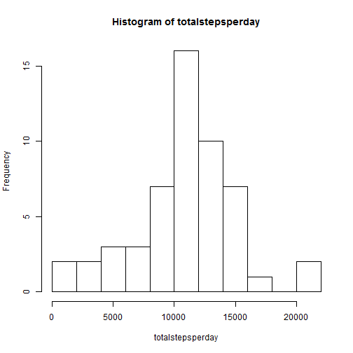
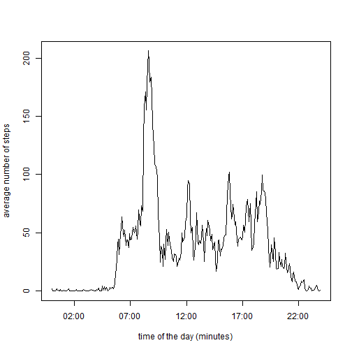
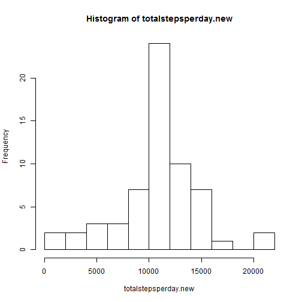
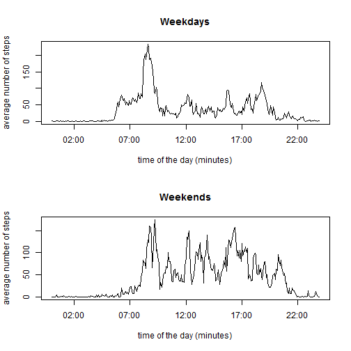

## Loading and preprocessing the data
###Load the data
The data cam be inputed in R using the link provided:


```r
library(dplyr)
activity <- read.csv("activity.csv")
```

A look at the data shows that it contains 3 variables: steps, date and interval.


```r
head(activity)
```

```
##   steps       date interval
## 1    NA 2012-10-01        0
## 2    NA 2012-10-01        5
## 3    NA 2012-10-01       10
## 4    NA 2012-10-01       15
## 5    NA 2012-10-01       20
## 6    NA 2012-10-01       25
```

The *steps* variable contains a certain number of NA values. The following code shows that missing values occurs only on certain dates and for the full day:


```r
n_na <- with(activity, tapply(steps, date, function(x) sum(is.na(x))))
n_na
```

```
## 2012-10-01 2012-10-02 2012-10-03 2012-10-04 2012-10-05 2012-10-06 
##        288          0          0          0          0          0 
## 2012-10-07 2012-10-08 2012-10-09 2012-10-10 2012-10-11 2012-10-12 
##          0        288          0          0          0          0 
## 2012-10-13 2012-10-14 2012-10-15 2012-10-16 2012-10-17 2012-10-18 
##          0          0          0          0          0          0 
## 2012-10-19 2012-10-20 2012-10-21 2012-10-22 2012-10-23 2012-10-24 
##          0          0          0          0          0          0 
## 2012-10-25 2012-10-26 2012-10-27 2012-10-28 2012-10-29 2012-10-30 
##          0          0          0          0          0          0 
## 2012-10-31 2012-11-01 2012-11-02 2012-11-03 2012-11-04 2012-11-05 
##          0        288          0          0        288          0 
## 2012-11-06 2012-11-07 2012-11-08 2012-11-09 2012-11-10 2012-11-11 
##          0          0          0        288        288          0 
## 2012-11-12 2012-11-13 2012-11-14 2012-11-15 2012-11-16 2012-11-17 
##          0          0        288          0          0          0 
## 2012-11-18 2012-11-19 2012-11-20 2012-11-21 2012-11-22 2012-11-23 
##          0          0          0          0          0          0 
## 2012-11-24 2012-11-25 2012-11-26 2012-11-27 2012-11-28 2012-11-29 
##          0          0          0          0          0          0 
## 2012-11-30 
##        288
```

###Process/transform the data (if necessary) into a format suitable for your analysis

A first processing step is to convert the dates in POSIX format for further analysis:

```r
date2 <- as.Date(activity$date)
activity <- transform(activity, date = date2)
```

A second processing step is to remove the NA values from the dataframe:

```r
activity.withoutna <- na.omit(activity)
str(activity.withoutna)
```

```
## 'data.frame':	15264 obs. of  3 variables:
##  $ steps   : int  0 0 0 0 0 0 0 0 0 0 ...
##  $ date    : Date, format: "2012-10-02" "2012-10-02" ...
##  $ interval: int  0 5 10 15 20 25 30 35 40 45 ...
##  - attr(*, "na.action")=Class 'omit'  Named int [1:2304] 1 2 3 4 5 6 7 8 9 10 ...
##   .. ..- attr(*, "names")= chr [1:2304] "1" "2" "3" "4" ...
```


## What is mean total number of steps taken per day?

###Calculate the total number of steps taken per day

The *tapply* function can be called to sum the number of 

```r
totalstepsperday <- with(activity.withoutna,tapply(steps,date,sum))
```

###Make a histogram of the total number of steps taken each day
The following histogram shows the distribution of the total steps per day for the period studied. 
 

```r
hist(totalstepsperday,breaks=10)
```

 

### Report the mean and median of the total number of steps taken per day
The mean and the median for the total number of steps per day are calculated the following way:

```r
mean <- mean(totalstepsperday, na.rm = TRUE)
median <- median(totalstepsperday, na.rm = TRUE)
```

Namely, the mean is 1.0766189 &times; 10<sup>4</sup> and the median is 10765.

## What is the average daily activity pattern?
###Make a time series plot 
For each time interval, we can calculate the average number of steps. 

```r
dailypattern <- data_frame(time = seq.POSIXt(ISOdatetime(2000,01,01,0,0,0), ISOdatetime(2000,01,01,23,55,0), by = "5 mins"), meansteps = with(activity.withoutna,tapply(steps,interval,mean, na.rm=TRUE)))
```

The following plot shows the average number of steps as a function of time in the day. 

```r
plot(dailypattern, xlab = "time of the day (minutes)", ylab = "average number of steps", type = "l")
```

 

A first observation is there is typically no activity from 10pm to 6am. Also, peaks in activity can be observed at around 9am, noon, 4pm and 7pm.

###5-minute interval with maximum average number of steps

The following code finds the maximum peak in the daily pattern.


```r
maximum <- max(dailypattern$meansteps)
timemax <- which.max(dailypattern$meansteps)
```

Namely, the maximum mean steps is 206.1698113 and is observed at time 8:35am.


## Imputing missing values
### Count missing values

As shown above, certain days contain no steps data. The following code count the number of missing values:

```r
sum.na <- sum(is.na(activity$steps))
```

Namely, 2304 do not have any information about the number of steps at each 5-minute intervals.

### Strategy for filling in all of the missing values in the dataset
Considering the little information we have, the best strategy for imputing the missing values is to replace any missing steps data for a given interval by the mean steps observed at that time. First, this would assure that we do not expect steps at hours of the night. Second, this should have no effect on the average number of steps per day for the whole dataset.

### Create new dataset
In the following code, a new dataframe similar to the original one is created. For any missing value, an *ifelse* statement get the mean steps at that time.


```r
activity.new <- activity
numberofdays <- length(unique(activity$date))
activity.new$meansteps <- rep(dailypattern$meansteps, numberofdays)
activity.new$steps2 <- ifelse(is.na(activity.new$steps),activity.new$meansteps, activity.new$steps)
```

### Make a histogram

The total number of steps per day can be recalculated for each day. The histogram of the total number of steps shows a similar distribution then reported before, except for the central column which has been "boosted". Therefore, the imputing strategy did effect the distribution of the estimates for the total number of steps taken per day.


```r
totalstepsperday.new <- with(activity.new,tapply(steps2,date,sum))
hist(totalstepsperday.new,breaks=10)
```

 

### Report new mean and median


```r
mean.new <- mean(totalstepsperday.new)
median.new <- median(totalstepsperday.new)
```

The mean and the median for the new distributions are calculated to be 1.0766189 &times; 10<sup>4</sup> and 1.0766189 &times; 10<sup>4</sup>, respectively.
As stated above, the imputing strategy had no impact on the data mean and median.


## Are there differences in activity patterns between weekdays and weekends?
### Create a new factor

The following code extract the weekdays for each of the dates. The dataset containing no missing values is used since the last section showed that imputing missing values had an incidence on the estimates of the total steps per day. Saturdays and sundays are recorded as weekend, and the rest as weekday. The data is then splited in two based on this factor.


```r
activity.withoutna$day <- weekdays(activity.withoutna$date)
activity.withoutna$weekend <- ifelse(activity.withoutna$day == "Saturday" | activity.withoutna$day == "Sunday", "weekend", "weekday")

activity.weekday <- subset(activity.withoutna, weekend == "weekday")
activity.weekend <- subset(activity.withoutna, weekend == "weekend")
```

A separate daily pattern can be calculated for the two datasets:


```r
weeklypattern <- data_frame(time = seq.POSIXt(ISOdatetime(2000,01,01,0,0,0), ISOdatetime(2000,01,01,23,55,0), by = "5 mins"),
                           weekday.meansteps = with(activity.weekday,tapply(steps,interval,mean, na.rm=TRUE)),
                           weekend.meansteps = with(activity.weekend,tapply(steps,interval,mean, na.rm=TRUE)))
```

Finaly, the following plots the average daily pattern for the weekdays and the weekends seperatly:


```r
par(mfrow = c(2,1))
plot(weeklypattern$time,
     weeklypattern$weekday.meansteps, 
     xlab = "time of the day (minutes)", 
     ylab = "average number of steps", 
     main = "Weekdays",
     type = "l")
plot(weeklypattern$time,
     weeklypattern$weekend.meansteps, 
     xlab = "time of the day (minutes)", 
     ylab = "average number of steps", 
     main = "Weekends",
     type = "l")
```

 

Interestingly, the walking habbits during the week and the weekend are very different. Peaks are more frequent on the weekend, and a peak of activity is shown in the evening. In general, there seems to be more activity on the weekend than on the weekdays.

